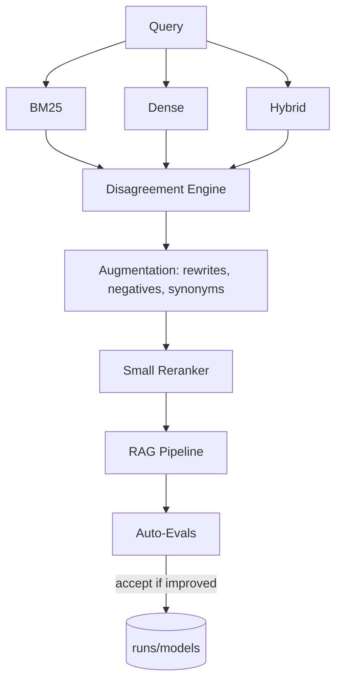

# AutoRAG-Live

Disagreement-driven, self-optimizing RAG system.


## Concept
Tri-view retrieval (BM25, dense, hybrid) + disagreement metrics drive data augmentation and a small reranker. A simple policy only accepts changes that improve eval metrics.

## Architecture (Mermaid)


## Requirements

⚠️ **Python 3.10+ Required** - This project requires Python 3.10 or higher due to modern typing features and dependencies.

## Quickstart
1. Create env and install deps
```bash
# Ensure you have Python 3.10+
python --version  # Should be 3.10.0 or higher

conda create -n autorag-live python=3.10 -y
conda run -n autorag-live pip install poetry
conda run -n autorag-live poetry install
```
2. Disagreement report
```bash
conda run -n autorag-live poetry run python -m autorag_live.cli disagree --query "the sun"
```
3. Eval
```bash
conda run -n autorag-live poetry run python -m autorag_live.cli eval --suite small
```
4. Dashboard
```bash
conda run -n autorag-live poetry run streamlit run app/streamlit_app.py
```

## CLI Cheatsheet
- `autorag disagree --query "..." --k 10 --report reports/run_YYYYMMDD.html`
- `autorag eval --suite small`
- `autorag optimize --queries "sun" "sky"` (auto-tune hybrid weights with acceptance policy)

## Advanced Usage

### Customizing Retrieval
You can customize the retrieval process by specifying the retriever type and parameters. For example:
```bash
conda run -n autorag-live poetry run python -m autorag_live.cli eval --suite small --retriever dense --top_k 5
```

### Adding New Queries
To evaluate new queries, simply pass them as arguments:
```bash
conda run -n autorag-live poetry run python -m autorag_live.cli eval --suite small --queries "What is AI?" "Explain deep learning."
```

### Using LLM Judges
For advanced evaluation, you can use LLM judges:
```bash
conda run -n autorag-live poetry run python -m autorag_live.cli eval --suite small --judge openai
```

### Optimizing Hybrid Weights
Auto-tune hybrid weights for better performance:
```bash
conda run -n autorag-live poetry run python -m autorag_live.cli optimize --queries "sun" "sky"
```

### Generating Disagreement Reports
Generate detailed disagreement reports for analysis:
```bash
conda run -n autorag-live poetry run python -m autorag_live.cli disagree --query "the sun" --report reports/disagreement.html
```

### Health Checks
Validate system health and dependencies:
```bash
python -m autorag_live.utils.health_check
```

Or in code:
```python
from autorag_live.utils.health_check import run_health_check

result = run_health_check(verbose=True)
if not result.is_healthy:
    print(f"System issues detected: {len(result.failed_checks)} checks failed")
```

### Performance Metrics
Track retrieval performance and cache efficiency:
```python
from autorag_live.utils.metrics_collector import get_metrics, print_metrics_report

metrics = get_metrics()
metrics.increment("retrieval.requests")
metrics.record_latency("retrieval.dense", 0.123)

# View metrics
print_metrics_report()
```

## Feature Highlights
- **Tri-View Retrieval**: Combines BM25, dense, and hybrid retrieval for robust performance.
- **Disagreement Metrics**: Identifies areas of improvement through disagreement analysis.
- **Self-Optimization**: Automatically tunes parameters to improve evaluation metrics.
- **Streamlit Dashboard**: Visualize results and insights interactively.
- **Extensible Architecture**: Easily add new retrievers, metrics, and evaluation suites.
- **Health Monitoring**: Built-in health checks and metrics collection for production deployments.
- **Input Validation**: Comprehensive validation utilities for robust error handling.

## Roadmap
- FAISS/Qdrant adapters, bandit hybrid tuning, LLM judges, PyPI release.
