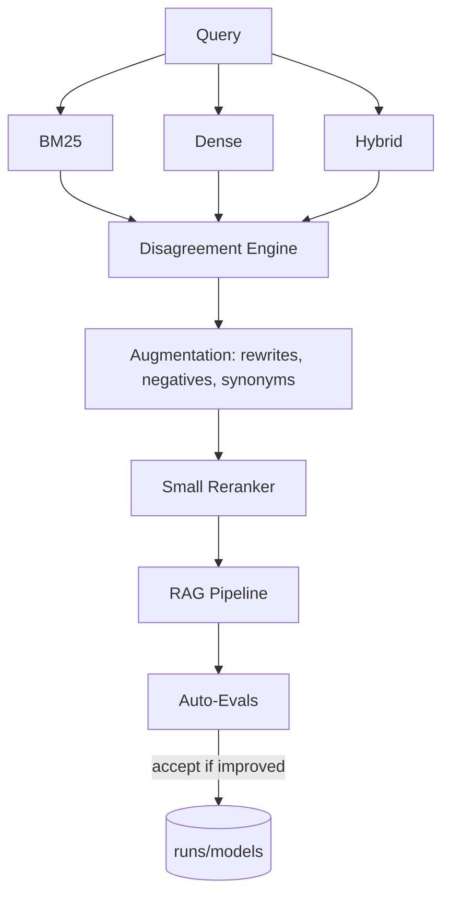

# AutoRAG-Live

Disagreement-driven, self-optimizing RAG system.


## Concept
Tri-view retrieval (BM25, dense, hybrid) + disagreement metrics drive data augmentation and a small reranker. A simple policy only accepts changes that improve eval metrics.

## Architecture (Mermaid)


## Quickstart
1. Create env and install deps
```bash
conda create -n autorag-live python=3.10 -y
conda run -n autorag-live pip install poetry
conda run -n autorag-live poetry install
```
2. Disagreement report
```bash
conda run -n autorag-live poetry run python -m autorag_live.cli disagree --query "the sun"
```
3. Eval
```bash
conda run -n autorag-live poetry run python -m autorag_live.cli eval --suite small
```
4. Dashboard
```bash
conda run -n autorag-live poetry run streamlit run app/streamlit_app.py
```

## CLI Cheatsheet
- `autorag disagree --query "..." --k 10 --report reports/run_YYYYMMDD.html`
- `autorag eval --suite small`
- `autorag optimize --queries "sun" "sky"` (auto-tune hybrid weights with acceptance policy)

## Roadmap
- FAISS/Qdrant adapters, bandit hybrid tuning, LLM judges, PyPI release.
