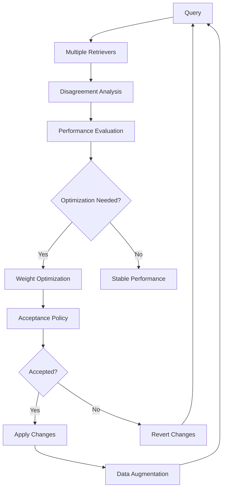

# Core Concepts

This page explains the fundamental concepts behind AutoRAG-Live's disagreement-driven, self-optimizing approach to RAG systems.

## 🎯 What is RAG?

Retrieval-Augmented Generation (RAG) combines the strengths of:
- **Retrieval**: Finding relevant documents from a knowledge base
- **Generation**: Using language models to synthesize answers

Traditional RAG systems use a single retrieval method, but AutoRAG-Live uses multiple retrievers and optimizes their combination.

## 🔄 Self-Optimization Loop

AutoRAG-Live's core innovation is its self-improvement loop:



### Components

1. **Multiple Retrievers**: BM25, dense, hybrid with different strengths
2. **Disagreement Analysis**: Measures how retrievers differ
3. **Performance Evaluation**: Comprehensive metrics (NDCG, MRR, diversity)
4. **Optimization**: Grid search, bandit algorithms for weight tuning
5. **Acceptance Policy**: Ensures improvements are statistically significant
6. **Data Augmentation**: Learns from disagreements to improve retrieval

## 📊 Disagreement Analysis

Disagreement measures how different retrievers rank the same documents:

### Jaccard Similarity
```python
def jaccard_at_k(results1: List[str], results2: List[str], k: int = 10) -> float:
    """Fraction of common documents in top-k results."""
    set1 = set(results1[:k])
    set2 = set(results2[:k])
    intersection = len(set1 & set2)
    union = len(set1 | set2)
    return intersection / union if union > 0 else 0.0
```

### Kendall Tau Rank Correlation
```python
def kendall_tau_at_k(results1: List[str], results2: List[str], k: int = 10) -> float:
    """Correlation between ranking positions."""
    # Measures how often pairs agree on relative ordering
```

### Why Disagreement Matters

- **Diversity**: Different retrievers find different relevant documents
- **Robustness**: System performance across varied queries
- **Optimization**: Disagreement indicates where improvements are possible

## ⚖️ Acceptance Policy

The acceptance policy prevents overfitting and ensures stable improvements:

```python
class AcceptancePolicy:
    def __init__(self, threshold: float = 0.01):
        self.threshold = threshold  # Minimum improvement required

    def evaluate_change(self, improvement: float) -> bool:
        return improvement >= self.threshold
```

### Safe Updates

```python
def safe_config_update(update_func, config_files, policy):
    # 1. Create backups
    # 2. Apply changes
    # 3. Evaluate improvement
    # 4. Accept or revert
```

## 🎛️ Hybrid Retrieval

Combines multiple retrieval methods with learned weights:

```python
def hybrid_retrieve(query: str, corpus: List[str], k: int = 10) -> List[str]:
    # Get BM25 scores
    bm25_scores = bm25_retrieve_with_scores(query, corpus)

    # Get dense scores
    dense_scores = dense_retrieve_with_scores(query, corpus)

    # Combine with weights
    combined_scores = {}
    for doc in corpus:
        score = (bm25_weight * bm25_scores.get(doc, 0) +
                dense_weight * dense_scores.get(doc, 0))
        combined_scores[doc] = score

    # Return top-k documents
    return sorted(combined_scores, key=combined_scores.get, reverse=True)[:k]
```

### Weight Optimization

AutoRAG-Live optimizes weights using:
- **Grid Search**: Exhaustive search over weight combinations
- **Bandit Algorithms**: UCB1 and Thompson Sampling for online optimization
- **Gradient-based**: Future work with differentiable retrieval

## 📈 Advanced Metrics

Beyond traditional IR metrics, AutoRAG-Live provides:

### NDCG (Normalized Discounted Cumulative Gain)
```python
def ndcg_at_k(retrieved: List[str], relevant: List[str], k: int) -> float:
    dcg = sum(rel / log2(i + 2) for i, rel in enumerate(relevance_scores[:k]))
    idcg = sum(1.0 / log2(i + 2) for i in range(min(len(relevant), k)))
    return dcg / idcg if idcg > 0 else 0.0
```

### Mean Reciprocal Rank (MRR)
```python
def mrr(queries_results: List[List[str]], relevant_sets: List[Set[str]]) -> float:
    reciprocal_ranks = []
    for results, relevant in zip(queries_results, relevant_sets):
        for i, doc in enumerate(results):
            if doc in relevant:
                reciprocal_ranks.append(1.0 / (i + 1))
                break
        else:
            reciprocal_ranks.append(0.0)
    return sum(reciprocal_ranks) / len(reciprocal_ranks)
```

### Diversity Score
```python
def diversity_score(documents: List[str], embeddings: np.ndarray) -> float:
    similarities = cosine_similarity(embeddings)
    avg_similarity = np.mean(similarities[np.triu_indices(len(similarities), k=1)])
    return 1.0 - avg_similarity  # Higher diversity = lower average similarity
```

## 🔧 Data Augmentation

AutoRAG-Live learns from retriever disagreements:

### Synonym Mining
```python
def mine_synonyms_from_disagreements(bm25_results, dense_results, hybrid_results):
    # Find documents where retrievers disagree
    # Extract terms that could be synonyms
    # Update synonym database
```

### Query Rewriting
```python
def rewrite_query_with_synonyms(query: str, synonyms: Dict[str, List[str]]) -> List[str]:
    # Generate query variants using synonyms
    # Return diverse query formulations
```

## 🚀 Production Features

### Time-Series Retrieval
```python
class TimeSeriesRetriever:
    def search(self, query: str, query_time: datetime, time_window_days: int):
        # Filter documents by temporal proximity
        # Combine temporal and content similarity
```

### Reranking
```python
class SimpleReranker:
    def rerank(self, query: str, documents: List[str]) -> List[str]:
        # Extract query-document features
        # Train simple ranking model
        # Return reordered documents
```

### Performance Monitoring
```python
class PerformanceBenchmark:
    def benchmark_function(self, func, iterations=100):
        # Measure execution time
        # Monitor memory usage
        # Calculate throughput
```

## 🎯 Best Practices

### Configuration
- Start with equal weights (0.5, 0.5) for BM25 and dense
- Use acceptance threshold of 0.01 for stable improvements
- Run optimization on diverse query sets

### Evaluation
- Use multiple metrics (NDCG, MRR, diversity)
- Evaluate on held-out queries
- Monitor for performance regressions

### Deployment
- Use Docker for consistent environments
- Monitor memory usage and latency
- Implement gradual rollout for configuration changes

## 🔮 Future Directions

- **Neural Optimization**: Differentiable retrieval for end-to-end training
- **Multi-modal**: Support for images, audio, and structured data
- **Federated Learning**: Privacy-preserving optimization across organizations
- **Real-time Adaptation**: Continuous learning from user feedback

---

Understanding these core concepts will help you effectively use and extend AutoRAG-Live for your specific use cases.