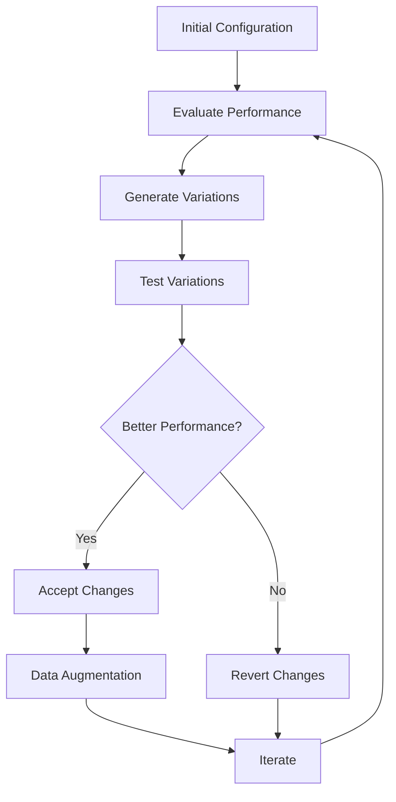

# Optimization

AutoRAG-Live includes sophisticated optimization techniques to automatically improve retrieval performance.

## 🎯 Optimization Goals

### Performance Optimization
- Maximize retrieval accuracy
- Minimize latency
- Optimize resource usage

### Robustness Optimization
- Handle diverse query types
- Reduce sensitivity to hyperparameters
- Improve generalization

## 🔄 Self-Optimization Loop

AutoRAG-Live's core optimization process:



## ⚖️ Acceptance Policy

Control when to accept or reject configuration changes.

```python
from autorag_live.pipeline import acceptance_policy

# Create acceptance policy
policy = acceptance_policy.AcceptancePolicy(
    threshold=0.01,     # Minimum improvement required
    metric_key="f1",    # Metric to evaluate
    best_runs_file="best_runs.json"
)

# Evaluate configuration changes
accepted = policy.evaluate_change(
    config_backup_paths={
        "config/retrieval.yaml": "config/retrieval.yaml.backup_20240101_120000"
    },
    runs_dir="runs"
)

if accepted:
    print("✅ Configuration changes accepted!")
else:
    print("❌ Changes reverted - insufficient improvement")
```

### Policy Configuration

```yaml
# config/pipeline.yaml
acceptance_policy:
  threshold: 0.005              # Minimum relative improvement
  metric_key: "f1"              # Primary evaluation metric
  best_runs_file: "best_runs.json"
  min_samples: 30               # Minimum samples for significance test
  confidence_level: 0.95        # Statistical confidence level
```

## 🎰 Bandit Optimization

Use multi-armed bandit algorithms for efficient optimization.

### UCB Bandit

```python
from autorag_live.pipeline import bandit_optimizer

# Create UCB bandit optimizer
bandit = bandit_optimizer.UCBBandit(
    arms=[
        {"bm25_weight": 0.2, "dense_weight": 0.8},
        {"bm25_weight": 0.5, "dense_weight": 0.5},
        {"bm25_weight": 0.8, "dense_weight": 0.2}
    ],
    alpha=1.0  # Exploration parameter
)

# Optimize over multiple rounds
for round_num in range(100):
    # Select arm (configuration)
    arm_idx = bandit.select_arm()
    config = bandit.arms[arm_idx]

    # Evaluate configuration
    score = evaluate_configuration(config)

    # Update bandit
    bandit.update(arm_idx, score)

# Get best configuration
best_config = bandit.get_best_arm()
print(f"Best configuration: {best_config}")
```

### Thompson Sampling

```python
# Thompson sampling bandit
bandit = bandit_optimizer.ThompsonSamplingBandit(
    arms=configurations,
    alpha=1.0,  # Success prior
    beta=1.0    # Failure prior
)
```

## 🔀 Hybrid Weight Optimization

Automatically tune the balance between BM25 and dense retrieval.

```python
from autorag_live.pipeline import hybrid_optimizer

# Grid search for optimal weights
best_weights, diversity_score = hybrid_optimizer.grid_search_hybrid_weights(
    queries=["machine learning", "artificial intelligence", "data science"],
    corpus=documents,
    k=10,
    grid_size=11  # Test 11x11 weight combinations
)

print(f"Optimal weights: BM25={best_weights.bm25_weight:.2f}, Dense={best_weights.dense_weight:.2f}")
print(f"Diversity score: {diversity_score:.3f}")

# Save optimized configuration
hybrid_optimizer.save_hybrid_config(best_weights, "optimal_weights.json")
```

### Advanced Optimization

```python
# Multi-objective optimization
weights, scores = hybrid_optimizer.multi_objective_optimize(
    queries=queries,
    corpus=corpus,
    objectives=["diversity", "performance", "latency"],
    weights=[0.4, 0.4, 0.2]  # Objective weights
)
```

## 🔧 Hyperparameter Tuning

### Automatic Tuning

```python
from autorag_live.pipeline import hyperparameter_tuner

# Define parameter space
param_space = {
    "bm25": {
        "k1": {"type": "float", "min": 1.0, "max": 2.0},
        "b": {"type": "float", "min": 0.0, "max": 1.0}
    },
    "dense": {
        "batch_size": {"type": "int", "min": 8, "max": 64}
    }
}

# Bayesian optimization
tuner = hyperparameter_tuner.BayesianTuner(
    param_space=param_space,
    objective=evaluate_configuration,
    max_evaluations=50
)

best_params = tuner.optimize()
print(f"Best parameters: {best_params}")
```

### Manual Tuning

```python
# Grid search
param_grid = {
    "k1": [1.2, 1.5, 1.8],
    "b": [0.5, 0.75, 0.9]
}

best_score = 0
best_params = {}

for k1 in param_grid["k1"]:
    for b in param_grid["b"]:
        config = {"bm25": {"k1": k1, "b": b}}
        score = evaluate_config(config)

        if score > best_score:
            best_score = score
            best_params = config
```

## 📊 A/B Testing

Compare different configurations statistically.

```python
from autorag_live.pipeline import ab_testing

# Create A/B test
test = ab_testing.ABTest(
    config_a={"retriever": "bm25"},
    config_b={"retriever": "hybrid"},
    metric="f1",
    significance_level=0.05
)

# Run test with multiple queries
for query in test_queries:
    result_a = evaluate_query(query, test.config_a)
    result_b = evaluate_query(query, test.config_b)

    test.add_sample(result_a, result_b)

# Get results
results = test.get_results()
if results["significant"]:
    winner = "A" if results["mean_a"] > results["mean_b"] else "B"
    print(f"Configuration {winner} is significantly better!")
```

## 🎯 Safe Configuration Updates

Automatically backup and revert failed changes.

```python
from autorag_live.pipeline import acceptance_policy

def safe_update_config(updates_func, config_files, policy):
    """Safely update configuration with automatic revert."""

    # Create backups
    backups = {}
    for config_file in config_files:
        backup_path = create_backup(config_file)
        backups[config_file] = backup_path

    try:
        # Apply updates
        updates_func()

        # Evaluate changes
        accepted = policy.evaluate_change(backups)

        if not accepted:
            # Revert changes
            revert_configs(backups)
            logger.warning("Configuration changes reverted")

        return accepted

    except Exception as e:
        # Revert on error
        revert_configs(backups)
        logger.error(f"Configuration update failed: {e}")
        return False

# Usage
def update_retrieval_config():
    # Modify configuration
    config = load_config("config/retrieval.yaml")
    config["dense"]["batch_size"] = 64
    save_config(config, "config/retrieval.yaml")

policy = acceptance_policy.AcceptancePolicy(threshold=0.01)
accepted = safe_update_config(
    update_retrieval_config,
    ["config/retrieval.yaml"],
    policy
)
```

## 📈 Performance Monitoring

Track optimization progress over time.

```python
from autorag_live.data import time_series

# Track optimization metrics
tracker = time_series.TimeSeriesTracker()

def log_optimization_step(step, config, score):
    """Log optimization progress."""
    tracker.add_note("optimization", {
        "step": step,
        "config": config,
        "score": score,
        "timestamp": time.time()
    })

# During optimization
for step in range(100):
    config = generate_config_variation()
    score = evaluate_config(config)
    log_optimization_step(step, config, score)

# Analyze optimization trends
trends = tracker.analyze_trends(days=7)
print(f"Optimization progress: {trends['slope']:.4f} per day")
```

## 🤖 Automated Optimization

Set up fully automated optimization pipelines.

```python
from autorag_live.pipeline import automated_optimizer

# Create automated optimizer
optimizer = automated_optimizer.AutomatedOptimizer(
    config_files=["config/retrieval.yaml", "config/evaluation.yaml"],
    optimization_interval=3600,  # Optimize every hour
    acceptance_policy=policy,
    bandit_type="ucb"
)

# Start automated optimization
optimizer.start()

# Monitor progress
while optimizer.is_running():
    status = optimizer.get_status()
    print(f"Optimization status: {status}")
    time.sleep(60)

# Stop optimization
optimizer.stop()
```

## 🔧 Optimization Configuration

Configure optimization in `config/pipeline.yaml`:

```yaml
pipeline:
  optimization:
    enabled: true
    interval_hours: 24
    max_iterations: 100
    early_stopping_patience: 10

  bandit_optimizer:
    type: "ucb"
    alpha: 1.0
    num_arms: 20

  hybrid_optimizer:
    grid_size: 11
    diversity_weight: 0.6
    performance_weight: 0.4

  hyperparameter_tuning:
    method: "bayesian"
    max_evaluations: 50
    random_state: 42
```

## 🎯 Best Practices

### Optimization Strategy

1. **Start Simple**: Begin with grid search
2. **Add Complexity**: Move to Bayesian optimization
3. **Ensure Safety**: Always use acceptance policies
4. **Monitor Progress**: Track optimization metrics
5. **Validate Results**: Use statistical significance tests

### Common Patterns

```python
# Optimization pipeline pattern
def optimize_pipeline():
    """Complete optimization pipeline."""

    # 1. Generate candidate configurations
    candidates = generate_candidates()

    # 2. Evaluate with early stopping
    best_score = 0
    patience = 10
    no_improve = 0

    for config in candidates:
        score = evaluate_config(config)

        if score > best_score:
            best_score = score
            best_config = config
            no_improve = 0
        else:
            no_improve += 1

        if no_improve >= patience:
            break

    # 3. Validate with statistical testing
    if is_significantly_better(best_config, baseline_config):
        deploy_config(best_config)

    return best_config
```

### Performance Considerations

```python
# Optimize for speed
fast_config = {
    "dense": {
        "model_name": "all-MiniLM-L6-v2",  # Smaller model
        "batch_size": 32,
        "device": "cpu"
    },
    "faiss": {
        "index_type": "IndexIVFFlat",  # Faster index
        "nprobe": 5  # Fewer probes
    }
}

# Optimize for accuracy
accurate_config = {
    "dense": {
        "model_name": "all-mpnet-base-v2",  # Better model
        "batch_size": 16,
        "device": "cuda"
    },
    "faiss": {
        "index_type": "IndexIVFPQ",  # Compressed but accurate
        "nprobe": 20
    }
}
```

## 📊 Optimization Metrics

Track optimization effectiveness:

```python
class OptimizationMetrics:
    def __init__(self):
        self.metrics = []

    def log_evaluation(self, config, score, latency):
        """Log evaluation results."""
        self.metrics.append({
            "config": config,
            "score": score,
            "latency": latency,
            "timestamp": time.time()
        })

    def get_optimization_stats(self):
        """Get optimization statistics."""
        scores = [m["score"] for m in self.metrics]
        latencies = [m["latency"] for m in self.metrics]

        return {
            "best_score": max(scores),
            "avg_score": sum(scores) / len(scores),
            "avg_latency": sum(latencies) / len(latencies),
            "total_evaluations": len(self.metrics)
        }
```
